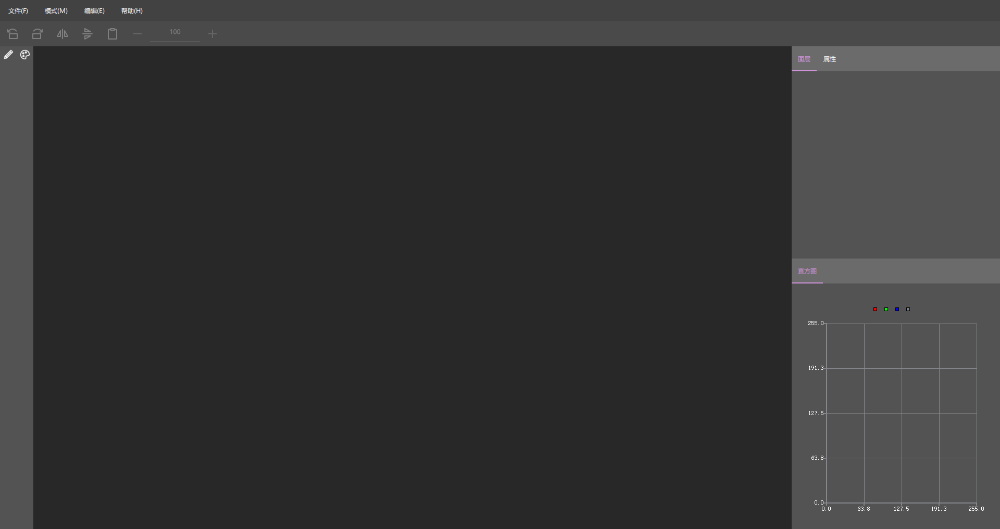
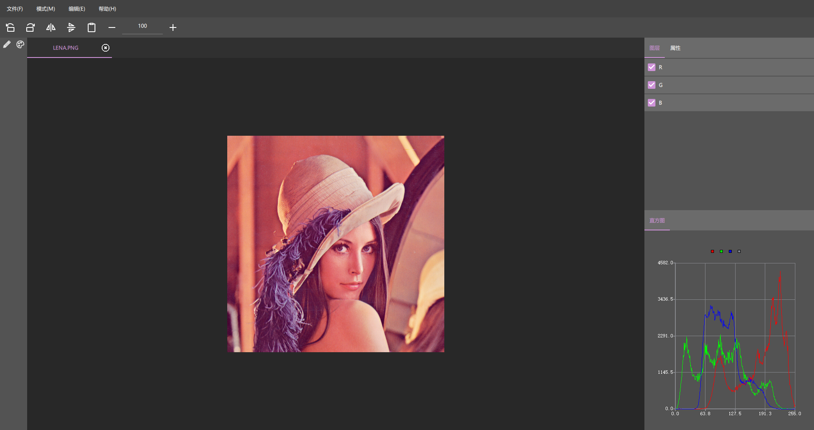
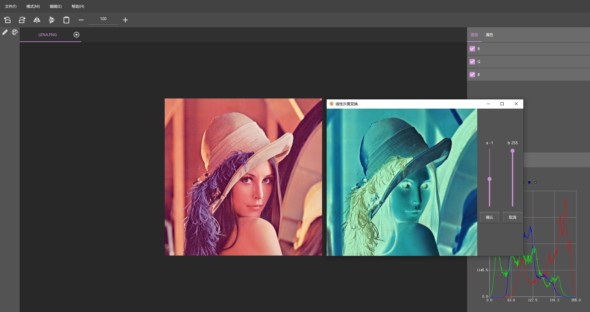
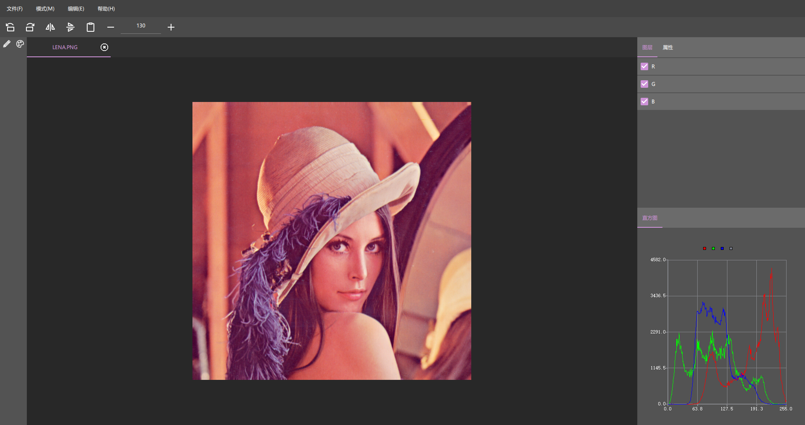
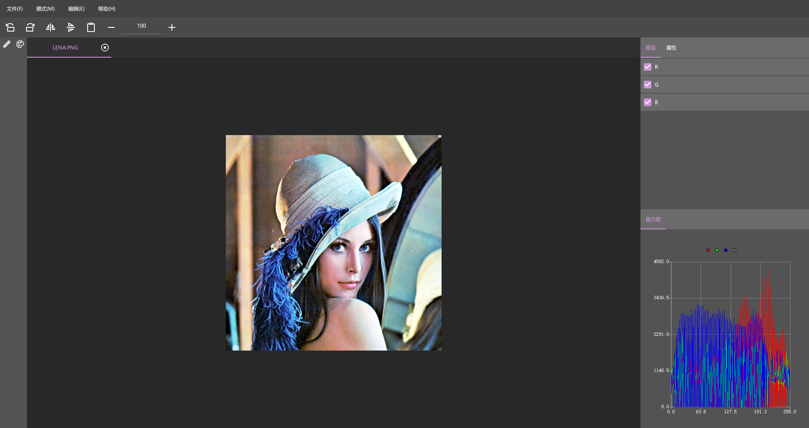

<h1 align="center">
    数字媒体处理平台
</h1>

## 🚀 快速开始

### 环境

- Visual Studio 2019
- Windows 10
- Cmake 3.25.2
- Qt 5.12.2

### 拉取代码

```bash
git clone https://github.com/Pear107/QPhotoEdit.git
```

### 构建

通过 Qt Creator 构建

## 🌲 目录树

```text
.
│   .gitattributes
│   .gitignore
│   CMakeLists.txt
│   CMakeLists.txt.user
│   README.md
│
└───src
    │   main.cpp
    │   qml.qrc
    │   qtquickcontrols2.conf
    │
    ├───app
    │       app.cpp
    │       app.h
    │
    ├───assets
    │   └───icon
    │           about.png
    │           checkMark.png
    │           clipboard.png
    │           close.png
    │           empty.png
    │           flipHorizontally.png
    │           flipVertically.png
    │           help.png
    │           language.png
    │           logo.ico
    │           open.png
    │           pencil.png
    │           platte.png
    │           rotateLeft.png
    │           rotateRight.png
    │           save.png
    │           website.png
    │           zoomIn.png
    │           zoomOut.png
    │
    ├───paint
    │       mini_paint.cpp
    │       mini_paint.h
    │       paint.cpp
    │       paint.h
    │
    ├───utils
    │       binarize.cpp
    │       binarize.h
    │       blur_img.cpp
    │       blur_img.h
    │       convert_color.cpp
    │       convert_color.h
    │       effect.cpp
    │       effect.h
    │       equalize_histogram.cpp
    │       equalize_histogram.h
    │       filter.cpp
    │       filter.h
    │       flip_img.cpp
    │       flip_img.h
    │       rotate_img.cpp
    │       rotate_img.h
    │       sharpen_img.cpp
    │       sharpen_img.h
    │       transfer_grayscale.cpp
    │       transfer_grayscale.h
    │
    └───view
        │   main.qml
        │   WAdapatBinarize.qml
        │   WBinarize.qml
        │   WBlur.qml
        │   WGaussBlur.qml
        │   WTransfer.qml
        │
        └───channel
                GrayChannel.qml
                RgbChannel.qml
```

## 依赖安装

### OpenCV

```bash
wget https://github.com/opencv/opencv/archive/refs/tags/4.5.5.zip
unzip 4.5.5.zip -d 4.5.5
wget https://www.raoyunsoft.com/opencv/opencv_contrib/opencv_contrib-4.5.5.zip
unzip opencv_contrib-4.5.5.zip -d opencv_contrib-4.5.5
cd 4.5.5
mkdir build
cd build
cmake \
  -DCMAKE_BUILD_TYPE=Release \
  -DOPENCV_EXTRA_MODULES_PATH=../../opencv_contrib-4.5.5/modules \
  -DQt5Concurrent_DIR=F:/ProgramData/Anaconda3/Library/lib/cmake/Qt5Concurrent \
  -DQt5Core_DIR=F:/ProgramData/Anaconda3/Library/lib/cmake/Qt5Core \
  -DQt5Gui_DIR=F:/ProgramData/Anaconda3/Library/lib/cmake/Qt5Gui \
  -DQt5OpenGL_DIR=F:/ProgramData/Anaconda3/Library/lib/cmake/Qt5OpenGL \
  -DQt5Test_DIR=F:/ProgramData/Anaconda3/Library/lib/cmake/Qt5Test \
  -DQt5Widgets_DIR=F:/ProgramData/Anaconda3/Library/lib/cmake/Qt5Widgets \
  -DQt5_DIR=F:/ProgramData/Anaconda3/Library/lib/cmake/Qt5 \
  ..
cmake --build . --config Release -j 2
cmake --build . --config Release --target install
```

## 预览










